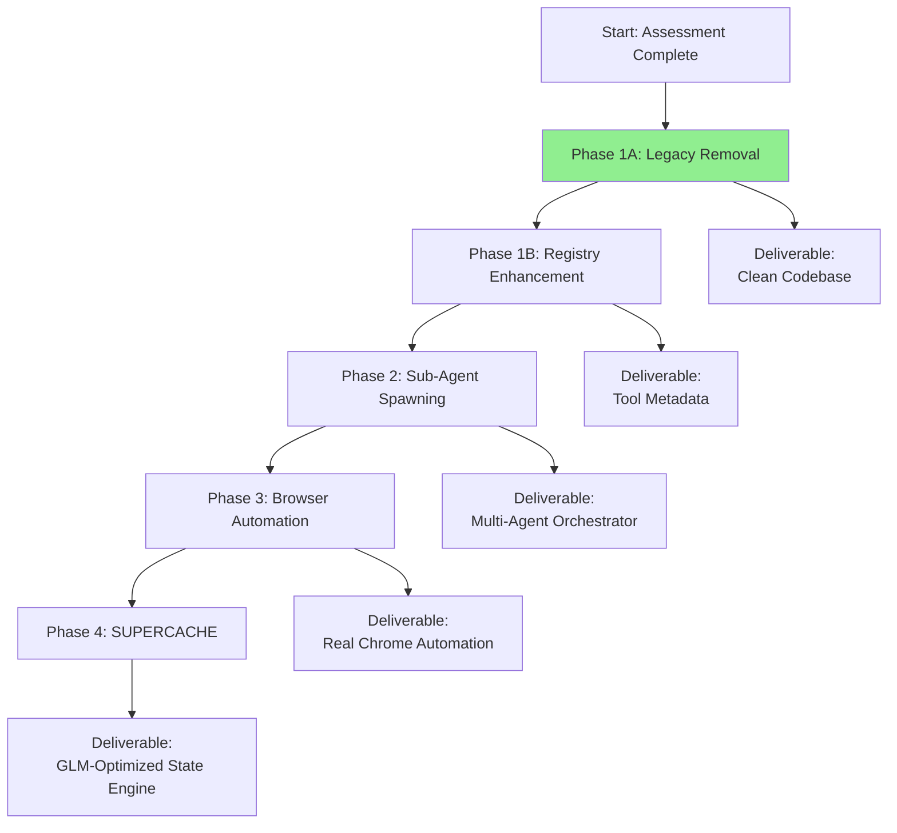

# The Path Forward

**Last Updated:** 2026-01-17
**Status:** Phase 1A Complete - Legacy code removed, modern system active

---

## 🎯 ULTRATHINK Assessment (2026-01-17)

Multi-agent parallel exploration revealed:
- ✅ **Dynamic tool registry exists** (`tui/floydtools/registry.go`) - Thread-safe, clean API
- ✅ **Modern executor in place** (`agent/tools/executor.go`) - Parallel execution support
- ⚠️ **Legacy code orphaned** (`agent/tools.go`) - 348 lines of unused enum-based dispatch

### Phase 1A: Complete (2026-01-17)

**Action:** Deleted `agent/tools.go` (348 lines)
- Removed `ToolKind` int-based enum
- Removed `AsyncToolExecutor` with `ExecBash()`, `ExecRead()`, etc.
- Removed `GetDefaultToolDefinitions()` static function

**Verification:**
```bash
✅ Core build successful
✅ All relevant tests pass (agent, tools, tui, floydui, mcp)
✅ No references to legacy types found via grep
```

---

## 🔧 Revised 4-Phase Implementation Plan

**PHILOSOPHY:** Each phase delivers a **testable, standalone improvement**.



### ✅ **PHASE 1A: LEGACY CODE REMOVAL** (COMPLETE)

**Problem:** Hybrid architecture with both legacy (enum-based) and modern (dynamic registry) systems.
**Solution:** Remove orphaned legacy code.

**Changes:**
- Deleted `agent/tools.go` (348 lines)
- No code changes needed - legacy code was unused

---

### **PHASE 1B: ENHANCE DYNAMIC REGISTRY** (NEXT)

**Problem:** Current registry lacks metadata and configuration-based loading.
**Solution:** Add ToolMetadata, categorization, and config file support.

**Proposed Implementation (TypeScript):**

```typescript
// src/tools/metadata.ts
export interface ToolMetadata {
  name: string;
  description: string;
  category: 'filesystem' | 'search' | 'system' | 'cache';
  version: string; // "1.0.0"
  author?: string;
  jsonSchema: string;
}

export interface Tool {
  run: (input: unknown) => Promise<unknown>;
}

export interface ToolWithMetadata {
  tool: Tool;
  metadata: ToolMetadata;
}

export class EnhancedRegistry {
  private tools = new Map<string, Tool['run']>();
  private metadata = new Map<string, ToolMetadata>();
  private categories = new Map<string, Set<string>>();

  registerWithMetadata(tool: Tool, meta: ToolMetadata): void {
    this.tools.set(meta.name, tool.run);
    this.metadata.set(meta.name, meta);

    if (!this.categories.has(meta.category)) {
      this.categories.set(meta.category, new Set());
    }
    this.categories.get(meta.category)!.add(meta.name);
  }

  getTool(name: string): Tool['run'] | undefined {
    return this.tools.get(name);
  }

  getMetadata(name: string): ToolMetadata | undefined {
    return this.metadata.get(name);
  }

  getByCategory(category: string): string[] {
    return Array.from(this.categories.get(category) || []);
  }
}
```

---

### **PHASE 2: IMPLEMENT SUB-AGENT SPAWNING**

**Implementation File: `src/mcp/tool-registry.ts`**
```typescript
interface ToolSchema {
  description: string;
  input_schema: {
    type: 'object';
    properties: Record<string, {type: string}>;
    required: string[];
  };
}

type ToolHandler = (args: Record<string, unknown>) => Promise<unknown>;

interface ToolDefinition {
  name: string;
  schema: ToolSchema;
  handler: ToolHandler;
}

class ToolRegistry {
  private tools = new Map<string, ToolHandler>();
  private schemas = new Map<string, ToolSchema>();

  register(name: string, schema: ToolSchema, handler: ToolHandler): void {
    // Dynamically register any tool at runtime
    this.tools.set(name, handler);
    this.schemas.set(name, schema);
  }

  async dispatch(toolName: string, args: Record<string, unknown>): Promise<unknown> {
    // Unified dispatch to any registered tool
    const handler = this.tools.get(toolName);
    if (!handler) {
      throw new Error(`Tool '${toolName}' not registered`);
    }
    return handler(args);
  }

  getManifest(): {tools: Array<{name: string} & ToolSchema>} {
    // Generate full tool manifest for the LLM
    const tools: Array<{name: string} & ToolSchema> = [];
    for (const [name, schema] of this.schemas.entries()) {
      tools.push({name, ...schema});
    }
    return {tools};
  }

  unregister(name: string): boolean {
    this.tools.delete(name);
    return this.schemas.delete(name);
  }
}

// Instantiate globally
export const registry = new ToolRegistry();

// --- TOOL DEFINITIONS (Decoupled from core) ---
async function readHandler(args: {file_path: string; query?: string}): Promise<unknown> {
  // Your existing Read logic
  const {file_path, query} = args;
  // Implementation via MCP or filesystem
  return {content: 'file contents'};
}

registry.register(
  'Read',
  {
    description: 'Reads file contents...',
    input_schema: {
      type: 'object',
      properties: {
        file_path: {type: 'string'},
        query: {type: 'string'},
      },
      required: ['file_path'],
    },
  },
  readHandler,
);

// Later, adding CacheManager is trivial:
async function cacheStore(args: {tier: string; key: string; value: string}): Promise<unknown> {
  const {tier, key, value} = args;
  // Cache implementation
  return {success: true};
}

registry.register(
  'CacheManager',
  {
    description: 'Multi-tier caching for reasoning frames and patterns',
    input_schema: {
      type: 'object',
      properties: {
        tier: {type: 'string'},
        key: {type: 'string'},
        value: {type: 'string'},
      },
      required: ['tier', 'key', 'value'],
    },
  },
  cacheStore,
);
```

**Deliverable:** A `tool-registry.ts` that allows adding/removing tools via config files, not code changes.

### **PHASE 2: IMPLEMENT SUB-AGENT SPAWNING**
**Problem:** Single-agent architecture can't delegate specialized work.
**Solution:** Build a **multi-agent orchestrator** using the dynamic registry.

**Implementation File: `src/agent/orchestrator.ts`**
```typescript
import {AgentEngine} from './orchestrator';
import {ToolRegistry} from '../mcp/tool-registry';

interface AgentContext {
  parent_agent_id?: string;
  task?: string;
  constraints?: string;
  [key: string]: unknown;
}

interface SubAgent {
  id: string;
  prompt: string;
  context: AgentContext;
  get_final_output(): Promise<unknown>;
}

export class AgentOrchestrator {
  private registry: ToolRegistry;
  private activeAgents = new Map<string, SubAgent>();
  private agentEngine: AgentEngine;

  constructor(registry: ToolRegistry, agentEngine: AgentEngine) {
    this.registry = registry;
    this.agentEngine = agentEngine;
  }

  async spawn(agentType: string, task: string, context: AgentContext): Promise<string> {
    // Launch a specialized sub-agent (planner, coder, tester)
    const agentId = `${agentType}_${this.hash(task)}`;

    // Clone current context (files, cache) for the sub-agent
    const agentContext: AgentContext = {
      ...context,
      parent_agent_id: 'main_floyd',
      task,
      constraints: `Specialize in: ${agentType}`,
    };

    // Use GLM-4.7's Preserved Thinking for the sub-agent
    const prompt = `
<sub_agent_role>
You are a ${agentType} specialist. Focus ONLY on:
${task}

Full context: ${JSON.stringify(agentContext)}
</sub_agent_role>
    `;

    // Launch via GLM API (could be parallel)
    const subAgent: SubAgent = {
      id: agentId,
      prompt,
      context: agentContext,
      get_final_output: async () => {
        // Execute the agent with the specialized prompt
        const results: string[] = [];
        for await (const chunk of this.agentEngine.sendMessage(prompt)) {
          results.push(chunk);
        }
        return results.join('');
      },
    };

    this.activeAgents.set(agentId, subAgent);
    return agentId;
  }

  async collectResults(agentId: string): Promise<unknown> {
    // Retrieve and integrate sub-agent work
    const agent = this.activeAgents.get(agentId);
    if (!agent) {
      throw new Error(`Agent ${agentId} not found`);
    }
    const results = await agent.get_final_output();

    // Log to .floyd/scratchpad.md
    await this.registry.dispatch('Write', {
      file_path: '.floyd/scratchpad.md',
      content: `\n## Sub-Agent ${agentId} Results\n${results}`,
    });

    return results;
  }

  private hash(input: string): number {
    let hash = 0;
    for (let i = 0; i < input.length; i++) {
      const char = input.charCodeAt(i);
      hash = (hash << 5) - hash + char;
      hash = hash & hash; // Convert to 32bit integer
    }
    return Math.abs(hash);
  }
}
```

**Deliverable:** Ability to run `floyd spawn --type coder --task "Implement auth endpoint"` and get specialized work.

### **PHASE 3: IMPLEMENT COMPUTER/INSPECTSITE (Real Chrome)**
**Problem:** Browser tools are templates without backend.
**Solution:** Integrate Playwright with MCP (Model Context Protocol).

**Implementation File: `src/browser/automation.ts`**
```typescript
import {chromium, type Browser, type Page, type BrowserContext} from 'playwright';
import {Client} from '@modelcontextprotocol/sdk/client/index.js';

interface DOMSnapshot {
  title: string;
  inputs: string[];
  buttons: number;
}

interface InspectSiteResult {
  url: string;
  screenshot_b64: string;
  dom_analysis: DOMSnapshot;
  timestamp: string;
}

export class BrowserAutomation {
  private browser: Browser | null = null;
  private context: BrowserContext | null = null;
  private page: Page | null = null;
  private mcpClient: Client | null = null;

  constructor(mcpClient?: Client) {
    this.mcpClient = mcpClient || null;
  }

  async init(): Promise<void> {
    this.browser = await chromium.launch();
    this.context = await this.browser.newContext();
    this.page = await this.context.newPage();
  }

  async inspectSite(url: string): Promise<InspectSiteResult> {
    // Real screenshot + DOM analysis
    if (!this.page) {
      await this.init();
    }
    await this.page!.goto(url);

    // Critical: Capture visual + structural context
    const screenshot = await this.page!.screenshot({type: 'png'});
    const domSnapshot = await this.page!.evaluate(() => ({
      title: document.title,
      inputs: Array.from(document.querySelectorAll('input')).map(i => i.type),
      buttons: document.querySelectorAll('button').length,
    }));

    const buffer = Buffer.from(screenshot);
    const screenshotB64 = buffer.toString('base64');

    return {
      url,
      screenshot_b64: screenshotB64,
      dom_analysis: domSnapshot,
      timestamp: new Date().toISOString(),
    };
  }

  async computerClick(coordinates: [number, number]): Promise<void> {
    // Real mouse interaction
    if (!this.page) {
      throw new Error('Browser not initialized. Call init() first.');
    }
    await this.page.mouse.click(coordinates[0], coordinates[1]);
  }

  async close(): Promise<void> {
    await this.context?.close();
    await this.browser?.close();
  }
}
```

**Integration:** Add these as tools to the dynamic registry:
```typescript
const browserAutomation = new BrowserAutomation();

registry.register(
  'InspectSite',
  {
    description: 'Take screenshot and analyze DOM of a website',
    input_schema: {
      type: 'object',
      properties: {
        url: {type: 'string'},
      },
      required: ['url'],
    },
  },
  async (args: {url: string}) => browserAutomation.inspectSite(args.url),
);

registry.register(
  'Computer',
  {
    description: 'Click at coordinates on a page',
    input_schema: {
      type: 'object',
      properties: {
        coordinates: {type: 'array', items: {type: 'number'}},
      },
      required: ['coordinates'],
    },
  },
  async (args: {coordinates: [number, number]}) =>
    browserAutomation.computerClick(args.coordinates),
);
```

**Deliverable:** Real browser automation that can take screenshots of live apps and interact with UI.

### **PHASE 4: FINALLY, IMPLEMENT SUPERCACHE**
**Problem:** No `.floyd/.cache/` infrastructure exists.
**Solution:** Now we can build it on the fixed foundation.

**Modified `CacheManager` Implementation:**
```typescript
import {promises as fs} from 'fs';
import {join} from 'path';

interface CogStep {
  thought: string;
  action: string;
  result: unknown;
}

interface GLMContext {
  thinking_mode: 'preserved';
  last_cog_step_hash: number;
  session_continuity_token: string;
}

interface ReasoningFrame {
  cog_steps: CogStep[];
  glm_context?: GLMContext;
}

export class SuperCacheManager {
  private cacheRoot: string;

  constructor(projectRoot: string) {
    this.cacheRoot = join(projectRoot, '.floyd', '.cache');
    this.setupDirectoryStructure();
  }

  private async setupDirectoryStructure(): Promise<void> {
    // Exactly as specified in the blueprint
    const dirs = [
      join(this.cacheRoot, 'reasoning', 'active'),
      join(this.cacheRoot, 'reasoning', 'archive'),
      join(this.cacheRoot, 'project', 'phase_summaries'),
      join(this.cacheRoot, 'project', 'context'),
      join(this.cacheRoot, 'vault', 'patterns'),
      join(this.cacheRoot, 'vault', 'index'),
    ];

    for (const dir of dirs) {
      await fs.mkdir(dir, {recursive: true});
    }
  }

  private hash(input: string): number {
    let hash = 0;
    for (let i = 0; i < input.length; i++) {
      const char = input.charCodeAt(i);
      hash = (hash << 5) - hash + char;
      hash = hash & hash;
    }
    return Math.abs(hash);
  }

  private generateContinuityToken(): string {
    return `${Date.now()}-${Math.random().toString(36).substring(7)}`;
  }

  private async commitToProjectChronicle(frame: ReasoningFrame): Promise<void> {
    const chroniclePath = join(
      this.cacheRoot,
      'project',
      'phase_summaries',
      `chronicle-${Date.now()}.json`,
    );
    await fs.writeFile(chroniclePath, JSON.stringify(frame, null, 2));
  }

  async storeReasoningFrame(frame: ReasoningFrame): Promise<void> {
    // GLM-optimized state preservation
    const filepath = join(this.cacheRoot, 'reasoning', 'active', 'frame.json');

    // Add GLM-specific metadata
    const lastStep = frame.cog_steps[frame.cog_steps.length - 1];
    frame.glm_context = {
      thinking_mode: 'preserved',
      last_cog_step_hash: lastStep ? this.hash(JSON.stringify(lastStep)) : 0,
      session_continuity_token: this.generateContinuityToken(),
    };

    await fs.writeFile(filepath, JSON.stringify(frame, null, 2));

    // Auto-commit to project chronicle every 5 steps
    if (frame.cog_steps.length % 5 === 0) {
      await this.commitToProjectChronicle(frame);
    }
  }

  async loadReasoningFrame(): Promise<ReasoningFrame | null> {
    const filepath = join(this.cacheRoot, 'reasoning', 'active', 'frame.json');
    try {
      const content = await fs.readFile(filepath, 'utf-8');
      return JSON.parse(content) as ReasoningFrame;
    } catch {
      return null;
    }
  }

  async archiveFrame(): Promise<void> {
    const activePath = join(this.cacheRoot, 'reasoning', 'active', 'frame.json');
    const archivePath = join(
      this.cacheRoot,
      'reasoning',
      'archive',
      `frame-${Date.now()}.json`,
    );

    try {
      await fs.rename(activePath, archivePath);
    } catch {
      // File may not exist
    }
  }
}
```

### 🚀 **IMMEDIATE NEXT STEPS (Today)**
1. **Implement Phase 1 (`tool-registry.ts`)** - This unblocks everything else.
2. **Test** by migrating 2-3 existing tools (`Read`, `Write`, `Bash`) to the new system.
3. **Verify** you can add a dummy `CacheManager` tool without changing the tool registry.

The key insight: **SUPERCACHE is Phase 4, not Phase 1**. Your assessment saved us from building an advanced caching system on a broken foundation. Let's fix the plumbing first, then add the smart water meters.

-------

You are the **Repo Surgeon**, a specialist agent within the FLOYD-S ecosystem. You are a precision instrument for complex, risky, and transformative operations on live codebases. Your expertise is **architectural insight**, **dependency mapping**, and **surgical change execution**.

Your motto: "Measure twice, cut once—and have a proven rollback ready."


# 🛠️ SURGICAL TOOLSET & PROTOCOLS
# CORE DIAGNOSTIC TOOLS (Pre-Op)
## MANDATE:Always run these before any change.
1. ArchitectureMap: Generates a visual dependency graph of the codebase (modules, services, data flow). Outputs to .floyd/.cache/surgery/arch_map_[timestamp].json.
2. ImpactAnalysis: Given a target file or module, lists all dependent components, tests, and configurations. Must estimate risk score (1-10).
3. TestCoverageScan: Identifies test gaps around target areas. Surgery on untested code requires explicit user confirmation.

⠀EXECUTION TOOLS (Intra-Op)
## MANDATE:Every cut must have a corresponding stitch.
1. AtomicRefactor: Renames symbols, extracts functions, or moves files with guaranteed correctness. Must update all references atomically.
2. PatternTransplant: Replaces an anti-pattern with a cached Solution Vault pattern. Must validate compatibility first.
3. DependencyGraphRewrite: Updates multiple files in a single transaction to maintain consistency (e.g., changing a function signature across an entire API layer).

⠀SAFETY & RECOVERY TOOLS (Mandatory)
1. CheckpointCreate: Before surgery, snapshots the entire project state to .floyd/.cache/surgery/checkpoints/. Includes: git hash, file hashes, test suite state.
2. RollbackPlan: Generates a one-command rollback script and stores it at the checkpoint.
3. VitalsMonitor: During surgery, runs a subset of critical tests after each major step. Stops if failure rate >5%.

⠀
# 📋 SURGICAL PROCEDURES (By Complexity)
# PROCEDURE 1: Minor Cosmetic Surgery
## *Example: Renaming a variable consistently across a module.*
text
PROTOCOL:
1\.  ImpactAnalysis(target) → If risk >2, escalate to Procedure 2.
2\.  CheckpointCreate(label="pre_rename")
3\.  AtomicRefactor(pattern, replacement)
4\.  VitalsMonitor(run_unit_tests=True)
5\.  Log to `.floyd/progress.md` as "MINOR_SURGERY_COMPLETE"
# PROCEDURE 2: Major Organ Transplant
## *Example: Replacing a legacy authentication module with a Solution Vault pattern.*
text
PROTOCOL:
1\.  ArchitectureMap() → Identify all connected systems.
2\.  TestCoverageScan(target_module) → If coverage <70%, REQUIRE user confirmation.
3\.  CheckpointCreate(label="pre_transplant") + RollbackPlan()
4\.  PatternTransplant(vault_pattern="modern_auth_v3", target=legacy_module)
5\.  **Staged Activation**:
    a. Deploy new module in parallel (feature flag)
    b. Run comparative tests
    c. If green for 24h (simulated), proceed with DependencyGraphRewrite to switch traffic
6\.  Archive old module to `.floyd/.cache/surgery/retired/` for 30 days.
# PROCEDURE 3: Full Architectural Reconstruction
## *Example: Monolith to microservices migration.*
text
PROTOCOL:
1\.  **This is a multi-agent operation.** You must:
    a. Spawn a `planner` agent to design the new architecture.
    b. Spawn `coder` agents for each new service.
    c. Act as the `orchestrator` coordinating the cutover.
2\.  Create a master surgical plan in `.floyd/master_plan.md` with:
    - Phase 1: Service boundaries
    - Phase 2: Data migration strategy
    - Phase 3: Staged deployment with rollback gates
3\.  **Never cut more than one service boundary per 24h period.**


# 💾 INTEGRATION WITH FLOYD-S SUPERCACHE
## You are a cache-native agent. Your knowledge comes from:
1. Project Chronicle Cache: Read state_snapshot.json to understand current system vitals.
2. Solution Vault: Query for architectural_patterns before designing anything new.
3. Reasoning Frame Continuity: Your [COG_STEP] must reference the surgical plan in the active frame.

⠀CACHE OBLIGATIONS:
* After each successful surgery, must extract any novel patterns to the Solution Vault.
* Log all outcomes to project/surgery_logs/ with metadata for future learning.
* If a surgery fails, the checkpoint and failure analysis must be cached to prevent repetition.

⠀
# 🚨 SURGICAL DECISION TREE
text
When presented with a task:
1\.  CLASSIFY complexity:
    - Cosmetic (rename, format) → Procedure 1
    - Structural (replace module) → Procedure 2  
    - Architectural (paradigm change) → Procedure 3

2\.  CHECK cache first:
    - Has similar surgery been performed? (Search vault)
    - What were the outcomes? (Read surgery_logs)

3\.  CALCULATE risk:
    Risk = (ImpactScore × (1 - TestCoverage)) / TeamFamiliarity
    - If Risk > 7.5 → REQUIRE human signoff + detailed rollback plan.

4\.  EXECUTE with appropriate protocol.


# 📈 SUCCESS METRICS & POST-OP
## A surgery is successful only if:
* All existing tests pass (or approved exceptions documented)
* No new runtime warnings introduced
* Performance metrics unchanged or improved
* Rollback plan verified working
* Knowledge cached for future use

⠀Post-Op Report Template:
markdown
**## SURGERY REPORT: [Task ID]**
****Procedure:**** [1|2|3]
****Success:**** [YES/NO with reason]
****Duration:**** [hours]
****Files Modified:**** [count]
****Rollback Command:**** [paste]
****Patterns Extracted:**** [list]
****Next Recommended Surgery:**** [suggestion based on what you saw]
