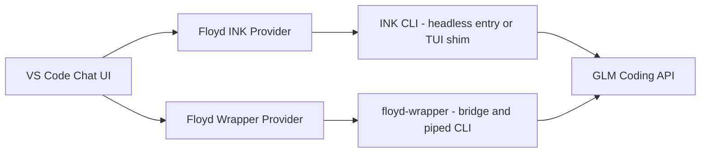

# 


# FLOYD - VS CODE AGENT

Short answer:  
- Yes, you can absolutely use the Floyd CLI (INK) and the Floyd wrapper (floyd-wrapper-main) as two separate “integrated agents” in VS Code.  
- The cleanest way is:  
  - Keep them as headless “services” (either via the existing bridge or by adding a simple JSON/stdio mode), and  
  - Build a small VS Code extension that exposes each as its own LanguageModelChatProvider (“Floyd INK” and “Floyd Wrapper”).  
- That way each agent appears in VS Code’s model picker, but the real brains, tools, and orchestration stay in your Floyd repos.

I’ll walk through:

1) What each of your CLIs currently does  
2) How to represent each as a separate VS Code agent  
3) Concrete integration strategies (piped stdin vs HTTP/WebSocket bridge vs JSON mode)  
4) Suggested extension structure and minimal code sketch


## 1. What we’re working with (from your repos)

### A) INK / floyd-cli

Location: `INK/floyd-cli`

Key points:

- Entry point: `src/cli.tsx` using Ink + meow【turn21fetch0】.  
- `package.json` bin: `"dist/cli.js"`; start script: `node dist/cli.js`【turn17fetch0】.  
- `src/app.tsx` is the Ink UI app and agent coordinator using `AgentEngine` from `floyd-agent-core`【turn22fetch0】.

Important constraints for VS Code integration:

- It’s a full TUI (Ink). The CLI checks for minimum terminal size and renders directly to `process.stdout`【turn21fetch0】.  
- It does NOT currently expose a headless/JSON mode. There’s no `--json` flag or non-interactive entry path we can see from here.

So: INK/floyd-cli is great for terminal use, but not directly suitable for an “agent API” from VS Code unless you add a headless entry or talk to the core agent engine directly.


### B) floyd-wrapper-main

Location: `floyd-wrapper-main`

Key points:

- Package name: `@cursem/floyd-wrapper`【turn27fetch0】.  
- Bin entries: `floyd`, `floyd-wrapper`, `floyd-tui` all point to `dist/cli.js` or `dist/cli-tui.js`【turn27fetch0】.  
- Main CLI: `src/cli.ts` with meow flags: `--debug`, `--tui`, `--bridge`, `--resume`【turn30fetch0】.  
- By default (no flags), it launches “wrapper mode” (interactive CLI)【turn30fetch0】.  
- It already detects piped stdin and handles it correctly for one-shot or scriptable use【turn32fetch0】【turn32fetch0】.  
- It has an HTTP/WebSocket bridge server at `src/bridge/`:

  - `startBridgeServer` in `src/bridge/cli.ts` starts Express + WebSocket server on a port (default 4000)【turn39fetch0】.  
  - Bridge server: `BridgeServer` in `src/bridge/server.ts` with:
    - HTTP routes: `/api/bridge/pairing`, `/api/bridge/status`, `/connect` etc.【turn41fetch0】【turn41fetch0】  
    - WebSocket path: `/ws`, secured with JWT tokens, and messages routed via `SessionRouter`【turn41fetch0】【turn45fetch0】.  
    - WS message handling defined in `src/bridge/session-router.ts`:
      - Accepts `MobileToBridgeMessage` with types: `'message' | 'command' | 'list-sessions' | 'create-session'`【turn48fetch0】【turn51fetch0】.  
      - Streams back `BridgeToMobileMessage` types: `'token' | 'tool-use' | 'tool-result' | 'done' | 'error' | 'sessions' | 'session-created'`【turn49find0】【turn51fetch0】.

This is important: the wrapper already has a programmatically-usable interface via:

- Piped stdin (for simple CLI automation), and  
- The bridge WebSocket API (for richer, streaming interaction).


## 2. Goal: two integrated VS Code agents

You said:

- Use Floyd CLI in INK folder  
- Use Floyd wrapper in floyd-wrapper-main  
- Each becomes a separate integrated agent you can switch between in VS Code (like you would switch models / providers)

High-level architecture:



- Both providers satisfy VS Code’s `LanguageModelChatProvider` interface, but internally:  
  - Floyd INK provider drives INK/floyd-cli (or its core)  
  - Floyd Wrapper provider drives floyd-wrapper-main (via CLI and/or bridge)


## 3. How to make the wrapper a first-class VS Code agent

You actually have two good options here:

### Option A – Use the wrapper in “piped stdin” mode (simplest, no changes to Floyd)

What the code already does:

- `src/cli.ts` detects piped input (`!process.stdin.isTTY`), resumes stdin, disables completers and TTY-specific behavior, and runs the readline loop over the piped input【turn32fetch0】【turn32fetch0】.  
- On `rl.close()` in piped mode, it waits for the message queue to flush before shutdown【turn32fetch0】.  
- All the Floyd orchestration, tools, GLM calls, etc., are inside `FloydAgentEngine` and invoked via `processInput`【turn32fetch0】.

From VS Code, you can drive it like this:

- Run `floyd` (or `floyd-wrapper`) as a long-lived child process.  
- For each user chat request from VS Code, write the user message to the process stdin (plus a newline).  
- Read its stdout as the streamed response.

Pros:

- No code changes to Floyd required.  
- You keep the same agent behavior / tools as in your terminal.

Cons:

- Stdout currently has a lot of TUI formatting and control sequences (chalk, log-update, etc.).  
- There is no `--json` mode or structured events, so your extension has to parse/color-strip text to separate “reasoning” from “final answer” vs “tool noise” etc.  
- If you restart the process per request, you lose session state; if you keep one long-lived process, you need a multiplexing protocol (e.g., JSON-RPC over stdin) so multiple VS Code chats don’t get their wires crossed.

So piped mode is viable, but not the cleanest for a tight VS Code integration unless you add some structured protocol on top.


### Option B – Use the wrapper’s WebSocket bridge (much cleaner, leverages existing work)

This is what I’d recommend for the wrapper agent.

From the code:

- `floyd --bridge` starts the bridge server on a configurable port (default 4000)【turn39fetch0】【turn43fetch0】.  
- WebSocket endpoint: `ws://localhost:4000/ws` (or whichever port you configure)【turn41fetch0】【turn43fetch0】.  
- WS connection handshake:

  - You must connect with a `?token=...` query param.  
  - Token is JWT signed by the bridge’s `TokenManager` using `FLOYD_JWT_SECRET` or a default secret【turn45fetch0】【turn39fetch0】.  
  - For a local VS Code extension, you can:
    - Either reuse the pairing flow and QR to generate a token, or
    - Add a small local-only “create token” API that the VS Code extension calls on `localhost` to get a JWT without going through mobile pairing.

- Messages from client (VS Code) to bridge are defined as `MobileToBridgeMessage` union:

  - `'message'`: `{ type: 'message', data: { content: string } }` – send a user message for Floyd to handle【turn48fetch0】【turn51fetch0】.  
  - `'command'`: `{ type: 'command', data: { command: string } }` – run a slash command etc.  
  - `'list-sessions'` / `'create-session'` for session management【turn48fetch0】【turn51fetch0】.

- Bridge -> client messages are `BridgeToMobileMessage`:

  - `'token'`: `{ type: 'token', sessionId, data: { token: string } }` – streamed LLM tokens【turn49find0】【turn51fetch0】.  
  - `'tool-use'`: `{ type: 'tool-use', sessionId, data: { tool, input } }` – Floyd invoking a tool【turn49find0】【turn51fetch0】.  
  - `'tool-result'`: `{ type: 'tool-result', sessionId, data: { tool, output } }` – tool result【turn49find0】【turn51fetch0】.  
  - `'done'`: `{ type: 'done', sessionId, data: { response: string } }` – final response for the message【turn49find0】【turn51fetch0】.  
  - `'error'`, `'sessions'`, `'session-created'` etc. for other control flows【turn49find0】【turn51fetch0】.

The `SessionRouter` already wires `FloydAgentEngine` callbacks to send these WS messages:

- When a token arrives from the LLM → `sendMessage(ws, { type: 'token', sessionId, data: { token } })`【turn49find0】.  
- When tool starts → `sendMessage(ws, { type: 'tool-use', ... })`【turn49find0】.  
- When tool completes → `sendMessage(ws, { type: 'tool-result', ... })`【turn49find0】.  
- When done → `sendMessage(ws, { type: 'done', sessionId, data: { response } })`【turn49find0】.

This is actually already a perfect “agent protocol” for VS Code.

How VS Code would use this:

1) Ensure Floyd is running:  
   - In the background, run: `floyd --bridge` (or have the extension start it on demand).  
   - It will listen on e.g. `http://localhost:4000` and `ws://localhost:4000/ws`【turn43fetch0】.

2) Extension gets a JWT token:  
   - Either:  
     - Call `POST /api/bridge/pairing` with a `sessionId` to get a token + QR handshake data【turn41fetch0】 (but you don’t need the QR),  
     - Or add a simple internal endpoint like `POST /api/bridge/dev-token` that generates a JWT without pairing for local dev.

3) Extension opens a WebSocket connection:  
   - `ws://localhost:4000/ws?token=YOUR_JWT`【turn41fetch0】.

4) When the user sends a chat message in VS Code:  
   - The extension sends:

     ```json
     {
       "type": "message",
       "data": {
         "content": "Refactor auth module to use GLM coding endpoint..."
       }
     }
     ```

   - The `SessionRouter.handleUserMessage` loads/creates a session and runs `FloydAgentEngine` with that content【turn48fetch0】.

5) Floyd streams back:  
   - Many `token` messages → VS Code appends tokens into the chat response.  
   - Optional `tool-use` / `tool-result` → you can show tool usage in the UI if you want.  
   - Finally a `done` message with the full aggregated response.

6) For multi-turn conversations:  
   - You keep the same WS open and reuse the same `sessionId`.  
   - Just send more `type: 'message'` messages.

This is very close to how a mobile client would talk to Floyd, but you don’t need NGROK or QR if it’s all local; you just need a lightweight way to mint a JWT for your VS Code extension.

This path keeps:

- All your existing Floyd tooling, permissions, MCPs, prompts, etc.  
- A structured streaming protocol that’s already defined.  
- VS Code just as a thin client.


## 4. How to make INK/floyd-cli into a separate VS Code agent

Here’s the harder part: INK is currently a TUI, not an API.

You’ve got a few reasonable options:

### Option 1 – Add a headless “JSON mode” to INK/floyd-cli

Best long-term option and minimally invasive:

- In `INK/floyd-cli/src/cli.tsx`, add a flag: `--json` or `--headless`.  
- When that flag is set:
  - Skip the Ink UI entirely (do not call `render(<App ... />`)【turn21fetch0】).  
  - Skip the terminal size check【turn21fetch0】.  
  - Read input either from:
    - A single line of stdin (for single-shot), or
    - A simple JSON RPC on stdin/stdout (for long-lived sessions).  
  - Output:
    - Only JSON objects:
      - `{ "type": "token", "token": "..." }`  
      - `{ "type": "tool-use", "tool": "...", "input": {...} }`  
      - `{ "type": "done", "response": "..." }`

You can reuse most of the internal logic from `App.tsx`:

- The app already creates `AgentEngine`, `MCPClientManager`, etc.【turn22fetch0】.  
- You could factor a `runHeadlessAgent({ input, callbacks })` function that:
  - Initializes the engine and MCP manager,  
  - Calls the engine with the user input,  
  - Emits JSON events instead of using Ink UI components.

Then from your VS Code extension:

- Launch: `floyd-cli --json` as a child process.  
- Send: `{"type":"message","content":"..."}\n` on stdin.  
- Parse JSON events line-by-line from stdout to stream tokens/tools.

This gives you a clean structured API for INK that mirrors the bridge’s WS protocol, but over stdio instead of network.


### Option 2 – Talk directly to INK’s AgentEngine (no CLI at all)

Since `INK/floyd-cli` imports `AgentEngine` from `floyd-agent-core`【turn22fetch0】, and your wrapper also uses `FloydAgentEngine` from `floyd-agent-core`【turn30fetch0】【turn32fetch0】:

- Your VS Code extension can:
  - Depend on `floyd-agent-core` directly, and
  - Instantiate an engine with INK-style configuration (different prompts / tools if you want) for the “INK agent”.  
  - Expose that engine via VS Code’s LM provider.

Upside:

- No CLI process at all; pure TS/JS API inside the extension host.  
- You have full control over streaming callbacks (tokens, tools, etc.) and can map them 1:1 to VS Code’s LM provider APIs.

Downside:

- You now have some logic duplicated between the INK CLI and the VS Code extension. You can mitigate this by keeping the agent configuration (prompts, tools, etc.) in shared `floyd-agent-core` modules that both the CLI and VS Code extension import.

If you’re comfortable treating the VS Code extension as another “front-end” for Floyd (like Desktop, Chrome, and Mobile), this is actually the cleanest long-term architecture.


### Option 3 – Use INK only for local dev, not directly in VS Code

Given that floyd-wrapper already has the bridge and a more “service-like” architecture, another pattern is:

- Use INK/floyd-cli as:
  - Your primary interactive TUI for local development / debugging.  
- Use floyd-wrapper-main as:
  - The agent backend for both VS Code and other “remote” front-ends (via the WS bridge).

In that case:

- You’d implement only the “Floyd Wrapper” provider in VS Code.  
- INK remains your power-user terminal interface, but not directly connected to VS Code.

If you want two distinct agents in VS Code, though, you probably still want to expose INK’s behavior (different prompts, modes, tools) as a separate provider, so Option 1 or 2 above becomes relevant.


## 5. How to model this as two VS Code LanguageModelChatProviders

VS Code’s chat API lets you register your own “model provider” via `vscode.chat.registerLanguageModelChatProvider`. You’d register two providers: one for INK, one for wrapper.

Conceptual sketch (TypeScript):

```ts
import * as vscode from 'vscode';

// Floyd Wrapper provider (WS-based bridge)
class FloydWrapperLMProvider implements vscode.LanguageModelChatProvider {
  async provideLanguageModelChatInformation() {
    return [
      {
        id: 'floyd-wrapper',
        name: 'Floyd Wrapper (GLM)',
        vendor: 'You / Legacy AI',
        version: '0.1.0',
        maxInputTokens: 200_000,
        maxOutputTokens: 128_000,
        capabilities: { toolCalling: true, vision: false },
      },
    ];
  }

  async provideLanguageModelChatResponse(
    modelId: string,
    request: vscode.LanguageModelChatRequest,
    _options: vscode.LanguageModelChatOptions,
    stream: vscode.LanguageModelChatResponseStream,
    _token: vscode.CancellationToken
  ) {
    const userMsg = request.messages.find(m => m.role === vscode.LanguageModelChatMessageRole.User);
    const content = typeof userMsg?.content === 'string' ? userMsg.content : '';

    // Connect to Floyd bridge WS; reuse a shared WS if you like
    const ws = new WebSocket('ws://localhost:4000/ws?token=...');

    ws.on('open', () => {
      ws.send(JSON.stringify({
        type: 'message',
        data: { content }
      }));
    });

    ws.on('message', (data: Buffer) => {
      const msg = JSON.parse(data.toString());
      switch (msg.type) {
        case 'token':
          stream.text(msg.data.token);
          break;
        case 'tool-use':
          // Optionally map to VS Code tool metadata if you want
          break;
        case 'done':
          // Final response is in msg.data.response if you want it
          break;
        case 'error':
          // VS Code doesn't have a great 'error' channel in the chat API yet;
          // you can include it in text or log.
          stream.text(`[ERROR] ${msg.data.error}`);
          break;
      }
    });

    // When the request is cancelled by VS Code, close WS
    _token.onCancellationRequested(() => {
      ws.close();
    });

    // You don't resolve here; the stream ends when WS closes or you decide.
  }
}

// Floyd INK provider (headless CLI; pseudo)
class FloydInkLMProvider implements vscode.LanguageModelChatProvider {
  async provideLanguageModelChatInformation() {
    return [
      {
        id: 'floyd-ink',
        name: 'Floyd INK (GLM)',
        vendor: 'You / Legacy AI',
        version: '0.1.0',
        maxInputTokens: 200_000,
        maxOutputTokens: 128_000,
        capabilities: { toolCalling: true, vision: false },
      },
    ];
  }

  async provideLanguageModelChatResponse(
    modelId: string,
    request: vscode.LanguageModelChatRequest,
    _options: vscode.LanguageModelChatOptions,
    stream: vscode.LanguageModelChatResponseStream,
    _token: vscode.CancellationToken
  ) {
    const userMsg = request.messages.find(m => m.role === vscode.LanguageModelChatMessageRole.User);
    const content = typeof userMsg?.content === 'string' ? userMsg.content : '';

    // Option A: spawn `floyd-cli --json` and parse JSON events from stdout
    // Option B: directly call floyd-agent-core headless inside extension
    // (Pseudo-code for Option A)

    const proc = spawn('floyd-cli', ['--json'], {
      cwd: '/path/to/Floyd/INK/floyd-cli',
    });

    proc.stdin.write(JSON.stringify({ type: 'message', content }) + '\n');

    const lineReader = (line: string) => {
      const obj = JSON.parse(line);
      if (obj.type === 'token') stream.text(obj.token);
      // ... handle other events as with WS
    };

    proc.stdout.on('data', (chunk: Buffer) => {
      chunk.toString().split('\n').forEach(lineReader);
    });

    _token.onCancellationRequested(() => proc.kill());
  }
}

export function activate(context: vscode.ExtensionContext) {
  const wrapperProvider = new FloydWrapperLMProvider();
  const inkProvider = new FloydInkLMProvider();

  const wrapperReg = vscode.chat.registerLanguageModelChatProvider('floyd-wrapper', wrapperProvider);
  const inkReg = vscode.chat.registerLanguageModelChatProvider('floyd-ink', inkProvider);

  context.subscriptions.push(wrapperReg, inkReg);
}
```

This pattern lets you:

- Switch between Floyd INK and Floyd Wrapper in VS Code’s model picker.  
- Keep all your Floyd logic (GLM integration, tools, prompts, caching) inside your existing repos.  
- Have the extension be mostly glue.


## 6. Concrete recommendations tailored to your stack

Given where you already are, here’s the path I’d take:

Short-term (quick, minimal code changes):

- For “Floyd Wrapper” agent:
  - Use the existing bridge (`floyd --bridge`).
  - Add a tiny internal `/api/bridge/dev-token` endpoint to generate JWTs for local VS Code without QR/mobile.
  - Implement a `FloydWrapperLMProvider` that:
    - Calls `/dev-token` to get a JWT,  
    - Opens a WS connection to `/ws?token=...`,  
    - Sends `{ type: 'message', data: { content } }` for each VS Code chat message,  
    - Streams `token` messages into `stream.text(...)`.

- For “Floyd INK” agent (if you really want it in VS Code):
  - Start by simply running INK’s `floyd-cli` in a terminal and using it separately (not wired into VS Code) while you:
  - Add a `--json` headless mode as described above.
  - Once that’s stable, wire up `FloydInkLMProvider` in the extension to drive it.

Medium-term (cleaner):

- Refactor `floyd-agent-core` so that:
  - Both `INK/floyd-cli` and `floyd-wrapper-main` instantiate their engines using shared configuration modules.  
  - The VS Code extension can optionally import those engine factories and run them directly, without forking CLI processes at all.

Long-term:

- Let INK and floyd-wrapper converge on a common “agent protocol” (like the WS bridge one) so that:
  - Any Floyd front-end (CLI, Desktop, Mobile, VS Code) speaks the same protocol.
  - The VS Code extension just becomes another client to that protocol.

That matches your “Floyd suite” vision: Claude Code + Claude Desktop + Claude Cowork + Chrome + VS Code, but all powered by Floyd + GLM.

If you’d like, I can next:

- Sketch the minimal changes needed in `INK/floyd-cli/src/cli.tsx` to add a `--json` headless mode, or  
- Design the small `/dev-token` endpoint for the bridge so your VS Code extension can obtain JWTs locally without any mobile/QR ceremony.