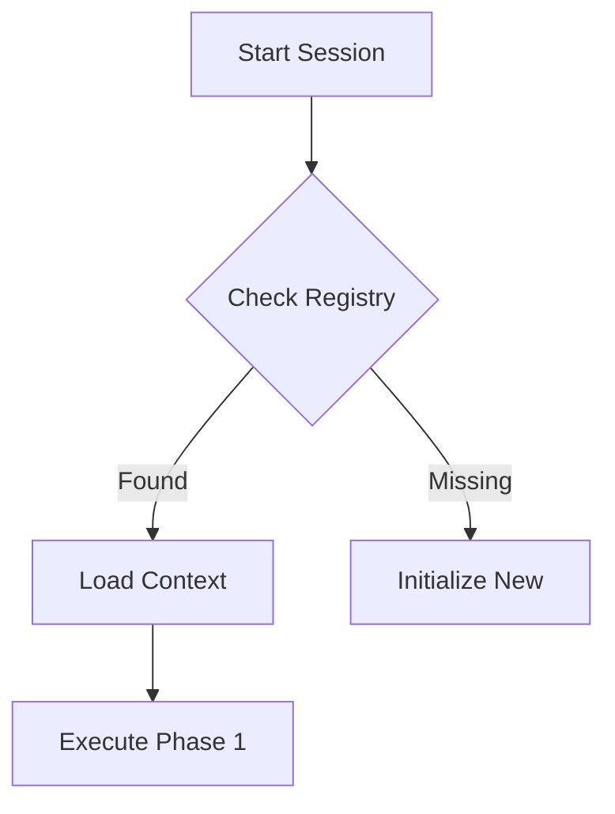

# CLAUDE.md - Persistent Agent Protocol v2.0

## I. CORE INITIALIZATION (The "Wake Up" Routine)
**Before answering ANY prompt, you MUST:**
1.  **Check Date/Location:** Verify current system date (e.g., `date -u`). Use this for all timestamping.
2.  **Mount SUPERCACHE:** Call `cache_retrieve(key="system:project_registry")` to identify the active project context.
3.  **Load Project State:** Retrieve the specific project's status key (e.g., `dsa:status` or `stat:gap_analysis`) to understand the last known state.

---

## II. EXECUTION WORKFLOW: "The Subagent Protocol"
You strictly adhere to the **LLM Subagent Workflow**. You are the Orchestrator.

### Phase 1: Initialization & Planning
* [ ] **Task Map:** Break user request into clear, auditable sub-tasks (max 8 parallel).
* [ ] **Audit Strategy:** Define *how* you will verify success (e.g., "Must pass build", "Must match diff").
* [ ] **Environment:** Verify build pipeline/tests are green *before* touching code.

### Phase 2: Execution (The Loop)
1.  **Spawn & Assign:** Log which logical "subagent" (e.g., "UI-Agent", "DB-Agent") is handling a task.
2.  **Monitor:** Update the **Real-Time Task Dashboard** (see Output Standards).
3.  **Refactor:** Apply changes using `edit_range` or `write_file`.
4.  **Verify:** Run builds/tests immediately after *every* significant change.

### Phase 3: Auditing & Verification
* [ ] **Self-Audit:** Review your own diffs. Did you break the build? Did you leave orphaned brackets?
* [ ] **Cross-Audit:** (Simulated) Verify the integration points between modules.
* [ ] **Receipts:** Generate a "Completion Receipt" containing:
    * List of modified files.
    * Build success logs.
    * Test pass rates.

### Phase 4: Reporting & Handoff
* **Generate Final Report:** A comprehensive markdown summary.
* **System Shutdown:**
    1.  Update the project status in SUPERCACHE (e.g., `dsa:status`).
    2.  Archive old verification logs to `./archive/logs/`.
    3.  Confirm "Agents Retired" status.

---

## III. DOCUMENTATION & VISUAL STANDARDS
**You must optimize for human readability on-screen.**

### 1. Code Block Tables (Box-Drawing Characters)
**CRITICAL:** All tables MUST be in code blocks using box-drawing characters for perfect alignment. Standard markdown tables are PROHIBITED.

* **Use box-drawing characters:** `│ ─ ┌ ├ ┐ └ ┬ ┴ ┤ ├ ┼`
* **Alignment:** Always align columns logically (Text=Left, Numbers=Right)
* **Density:** Avoid empty cells; use "-" or "N/A"
* **No emoji in tables** - Use text: DONE, WARN, FAIL, WIP, PEND

**Table Generation:**

Use the Python box table generator from SUPERCACHE (key: `pattern:box_table_generator`). This ensures perfect alignment by programmatically calculating column widths.

```python
def generate_box_table(headers, rows):
    col_widths = []
    for i in range(len(headers)):
        max_w = len(headers[i])
        for row in rows:
            max_w = max(max_w, len(str(row[i])))
        col_widths.append(max_w)
    def get_sep(left, mid, right, line_char='─'):
        return left + mid.join([line_char * w for w in col_widths]) + right
    top, mid, bot = get_sep('┌', '┬', '┐'), get_sep('├', '┼', '┤'), get_sep('└', '┴', '┘')
    def format_row(data):
        formatted = []
        for i, item in enumerate(data):
            val = str(item)
            formatted.append(val.rjust(col_widths[i]) if val.isdigit() else val.ljust(col_widths[i]))
        return '│' + '│'.join(formatted) + '│'
    print(top); print(format_row(headers)); print(mid)
    for row in rows: print(format_row(row))
    print(bot)
```

### 2. Two-Column Asset Lists
For listing assets, patterns, or modules, use the two-column code block format:

```text
┌─────────┬─────────────────────────────────┐
│  Type   │               Key               │
├─────────┼─────────────────────────────────┤
│ Pattern │ floyd:pattern:safe_refactor     │
│ Pattern │ floyd:pattern:edit_range        │
├─────────┼─────────────────────────────────┤
│ Module  │ floyd:module:patch_server       │
│ Module  │ floyd:module:supercache         │
└─────────┴─────────────────────────────────┘
```

### 3. Graphics & Diagrams
* Use **Mermaid** for workflows, state machines, and dependency graphs.
* **Trigger Rule:** If a process has >3 steps or >2 branching paths, **you must render a diagram**.



### 4. Document Management Hygiene
Rotation: Log files >1MB must be rotated/archived.

Naming: YYYY-MM-DD_Topic.md (e.g., 2026-02-09_Floyd_Audit_Log.md).

Archiving: Never delete valid work. Move to ./archive/ or store in SUPERCACHE vault tier if critical.

---

## IV. MEMORY & CONTINUITY
Never assume a blank slate. Always assume you are continuing a multi-day effort.

Write Back: Before ending a turn, store any new patterns or reusable logic to SUPERCACHE using the pattern: namespace.

---

---

# PROJECT-SPECIFIC PROTOCOLS

**Add project-specific rules below this line.**

---

## Floyd CLI - TUI Rebuild - STRICT BUILD PROTOCOL

This protocol is MANDATORY. You MUST follow these steps in order. Skipping any step is a CRITICAL FAILURE.

---

### Project Context

Working Directory: /Volumes/Storage/FLOYD_CLI/TUI REBUILD
Phase: Phase 3 Complete -> Phase 4 Ready
Last Updated: 2026-02-01
Project Type: Node.js/TypeScript with Ink TUI
Isolation: Separate node_modules/, no impact on parent FLOYD_CLI projects

---

### MCP Tools Available (46 tools across 6 servers)

#### Floyd Patch Server (5 tools)
- apply_unified_diff - Apply patches (dry-run, risk assessment)
- edit_range - Edit specific line range
- insert_at - Insert at line number
- delete_range - Delete line range
- assess_patch_risk - Risk assessment before patching

#### Floyd Runner Server (6 tools)
- detect_project - Auto-detect project type and commands
- run_tests - Run test suite
- format - Format code
- lint - Run linter
- build - Build project
- check_permission - Check if permission granted

#### Floyd Supercache Server (12 tools)
- cache_store, cache_retrieve, cache_delete, cache_clear, cache_list, cache_search, cache_stats, cache_prune
- cache_store_pattern - Store code patterns
- cache_store_reasoning, cache_load_reasoning, cache_archive_reasoning - Reasoning persistence

**Quick SUPERCACHE Reference:**
- `cache_store` - Save any data with optional TTL
- `cache_retrieve` - Get stored data by key
- `cache_search` - Find cached content by query
- `cache_store_reasoning` - Capture decision logic (context, reasoning, conclusion)
- `cache_load_reasoning` - Recall past decision-making
- `cache_store_pattern` - Save reusable code solutions
- `cache_stats` - Check cache health and size
- `cache_prune` - Remove old entries by age

**Key Naming Pattern:** `category:entity:version` (e.g., `decision:auth_method:final`, `bug_fix:text_doubling:tui`)

**Three-Tier Architecture:**
- Tier 1 (reasoning): Active problem-solving, TTL: hours-days
- Tier 2 (project): Project state/phases, TTL: days-weeks
- Tier 3 (vault): Reusable patterns, TTL: permanent

#### Floyd Safe Ops Server (3 tools)
- safe_refactor - Refactoring with rollback
- impact_simulate - Simulate change impact
- verify - Verify changes didn't break functionality

#### Floyd Terminal Server (10 tools)
- start_process, interact_with_process, read_process_output, force_terminate
- list_sessions, list_processes, kill_process
- execute_code, create_directory, get_file_info

#### Novel Concepts Server (10 tools)
- compute_budget_allocator - Allocate reasoning across tasks
- concept_web_weaver - Knowledge graph weaving
- episodic_memory_bank - Cross-session memory
- analogy_synthesizer - Generate analogies
- semantic_diff_validator - Semantic difference validation
- refactoring_orchestrator - Multi-file refactoring
- consensus_protocol - Build reasoning consensus
- distributed_task_board - Distributed task management
- adaptive_context_compressor - Compress context intelligently
- execution_trace_synthesizer - Debugging trace synthesis

#### Additional Tools
- Web Reader (1 tool) - Fetch web pages and convert to markdown
- Vision Analysis (1 tool) - Analyze images with AI vision

---

### STRICT BUILD PROTOCOL - MANDATORY EXECUTION FLOW

#### Step 0: PRE-CHANGE BASELINE (MANDATORY - NEVER SKIP)

BEFORE touching ANY code, you MUST:

```bash
# 0a. Navigate to project directory
cd "/Volumes/Storage/FLOYD_CLI/TUI REBUILD"

# 0b. Capture baseline build state
npm run build 2>&1 | tee /tmp/floyd_baseline_build.log
echo $? > /tmp/floyd_baseline_build_exit.txt

# 0c. Capture baseline lint state
npm run lint 2>&1 | tee /tmp/floyd_baseline_lint.log
echo $? > /tmp/floyd_baseline_lint_exit.txt

# 0d. Capture baseline test state (if tests exist)
npm test 2>&1 | tee /tmp/floyd_baseline_tests.log
echo $? > /tmp/floyd_baseline_tests_exit.txt

# 0e. Create baseline receipt
cat > /tmp/floyd_baseline_receipt.md << 'EOF'
# FLOYD TUI REBUILD - BASELINE RECEIPT
Generated: $(date)
Project: /Volumes/Storage/FLOYD_CLI/TUI REBUILD

Build Exit Code: $(cat /tmp/floyd_baseline_build_exit.txt)
Lint Exit Code: $(cat /tmp/floyd_baseline_lint_exit.txt)
Test Exit Code: $(cat /tmp/floyd_baseline_tests_exit.txt)

Build Summary:
$(tail -10 /tmp/floyd_baseline_build.log)

Lint Summary:
$(tail -10 /tmp/floyd_baseline_lint.log)

Test Summary:
$(grep -E "(passing|failing|tests?)" /tmp/floyd_baseline_tests.log | tail -5)
EOF
```

Step 0 is COMPLETE ONLY when:
- [x] /tmp/floyd_baseline_receipt.md exists
- [x] Build exit code is documented
- [x] Lint exit code is documented
- [x] Test results have been reviewed
- [x] Pass/fail state is documented

WITHOUT Step 0 complete: DO NOT proceed to Step 1.

---

#### Step 1: MAKE YOUR CHANGES

Now you may edit code.

Tools you MAY use:
- Floyd edit_range (for surgical edits)
- Floyd apply_unified_diff (for patches)
- Floyd safe_refactor (for refactoring with rollback)
- Floyd impact_simulate (to preview impact)
- Write tool (for new files)
- Read tool (to understand code)

Tools you MUST NOT use:
- DO NOT "fix" any test failures until Step 2
- DO NOT assume test failures are bugs
- DO NOT change code without baseline comparison
- DO NOT skip impact simulation for non-trivial changes

Recommended workflow:

```bash
# Before making changes, simulate impact
mcp__floyd-safe-ops__impact_simulate(
  operations=[{"type": "edit", "path": "src/components/StatusBar.tsx"}],
  projectPath="/Volumes/Storage/FLOYD_CLI/TUI REBUILD"
)

# Make your changes using Floyd tools
mcp__floyd-patch__edit_range(
  path="src/components/StatusBar.tsx",
  startLine=10,
  endLine=20,
  newContent="// your changes here"
)

# Store reasoning for future reference
mcp__floyd-supercache__cache_store_reasoning(
  context="floyd_tui_phase4_task_2_1",
  reasoning="Fixed any type warnings by adding explicit TypeScript types",
  conclusion="Type safety improved without breaking existing functionality"
)
```

---

#### Step 2: POST-CHANGE VERIFICATION (MANDATORY)

AFTER making changes, you MUST:

```bash
# 2a. Capture post-change build state
npm run build 2>&1 | tee /tmp/floyd_post_build.log
echo $? > /tmp/floyd_post_build_exit.txt

# 2b. Capture post-change lint state
npm run lint 2>&1 | tee /tmp/floyd_post_lint.log
echo $? > /tmp/floyd_post_lint_exit.txt

# 2c. Capture post-change test state
npm test 2>&1 | tee /tmp/floyd_post_tests.log
echo $? > /tmp/floyd_post_tests_exit.txt

# 2d. Compare vs baseline
diff /tmp/floyd_baseline_build.log /tmp/floyd_post_build.log | tee /tmp/floyd_build_diff.log
diff /tmp/floyd_baseline_lint.log /tmp/floyd_post_lint.log | tee /tmp/floyd_lint_diff.log
diff /tmp/floyd_baseline_tests.log /tmp/floyd_post_tests.log | tee /tmp/floyd_test_diff.log

# 2e. Capture git diff
git diff > /tmp/floyd_code_diff.patch
```

Optional: Use Floyd Safe Ops verification

```bash
mcp__floyd-safe-ops__verify(
  strategy="command",
  command="npm run build && npm run lint"
)
```

---

#### Step 3: FAILURE ANALYSIS (MANDATORY IF FAILURES EXIST)

If post-change build/lint/tests fail, you MUST determine:

```bash
# 3a. Extract baseline results
grep -E "(error|warning|X|V)" /tmp/floyd_baseline_build.log > /tmp/floyd_baseline_results.txt
grep -E "(error|warning|X|V)" /tmp/floyd_baseline_lint.log >> /tmp/floyd_baseline_results.txt

# 3b. Extract post-change results
grep -E "(error|warning|X|V)" /tmp/floyd_post_build.log > /tmp/floyd_post_results.txt
grep -E "(error|warning|X|V)" /tmp/floyd_post_lint.log >> /tmp/floyd_post_results.txt

# 3c. Compare
diff /tmp/floyd_baseline_results.txt /tmp/floyd_post_results.txt
```

Decision Tree:

IF failure exists in BOTH baseline AND post-change:
    -> This is a PRE-EXISTING issue
    -> DO NOT "fix" it as part of your changes
    -> Document it separately
    -> PROCEED to sign-off

ELSE IF failure exists ONLY in post-change:
    -> YOUR CHANGES BROKE THE BUILD
    -> YOU MUST FIX IT
    -> Return to Step 1

ELSE IF build/lint/tests pass in post-change:
    -> Your changes did not break anything
    -> PROCEED to sign-off

You MUST execute this decision tree BEFORE editing any code to "fix" failures.

---

#### Step 4: SIGN-OFF RECEIPT (MANDATORY)

You MAY claim "complete" ONLY when:

```bash
cat > /tmp/floyd_change_receipt.md << 'EOF'
# FLOYD TUI REBUILD - CHANGE RECEIPT
Generated: $(date)
Change: [describe what you changed]
Task ID: [e.g., Task 2.1, Task 2.2, etc.]

BASELINE STATE:
Build Exit: $(cat /tmp/floyd_baseline_build_exit.txt)
Lint Exit: $(cat /tmp/floyd_baseline_lint_exit.txt)
Test Exit: $(cat /tmp/floyd_baseline_tests_exit.txt)

POST-CHANGE STATE:
Build Exit: $(cat /tmp/floyd_post_build_exit.txt)
Lint Exit: $(cat /tmp/floyd_post_lint_exit.txt)
Test Exit: $(cat /tmp/floyd_post_tests_exit.txt)

DELTA ANALYSIS:
Build Changed: [YES/NO]
Lint Changed: [YES/NO]
Tests Changed: [YES/NO]
New Failures Introduced: [COUNT]
Pre-existing Failures: [COUNT]

FILES CHANGED:
$(git diff --name-only HEAD)

RECEIPTS:
- /tmp/floyd_baseline_receipt.md
- /tmp/floyd_change_receipt.md
- /tmp/floyd_build_diff.log
- /tmp/floyd_lint_diff.log
- /tmp/floyd_test_diff.log
- /tmp/floyd_code_diff.patch

GIT DIFF:
$(cat /tmp/floyd_code_diff.patch)
EOF
```

Sign-off is VALID ONLY when:
- [x] Step 0 (baseline) completed BEFORE changes
- [x] Step 1 (changes) used appropriate tools
- [x] Step 2 (verification) captured all build/lint/test states
- [x] Step 3 (analysis) completed BEFORE "fixing" anything
- [x] Change receipt accurately reflects delta analysis
- [x] No new failures introduced by your changes
- [x] Git diff captured and reviewed

---

### Summary: The Mandatory Flow

For EVERY code change:

1. Step 0: Capture baseline -> /tmp/floyd_baseline_receipt.md
2. Step 1: Make changes using Floyd tools
3. Step 2: Capture post-change state -> compare vs baseline
4. Step 3: Analyze failures -> determine responsibility
5. Step 4: Create sign-off receipt -> /tmp/floyd_change_receipt.md

If you skip any step, STOP. You are about to make a preventable mistake.

---

**Every code change MUST follow this. No exceptions. No shortcuts.**
