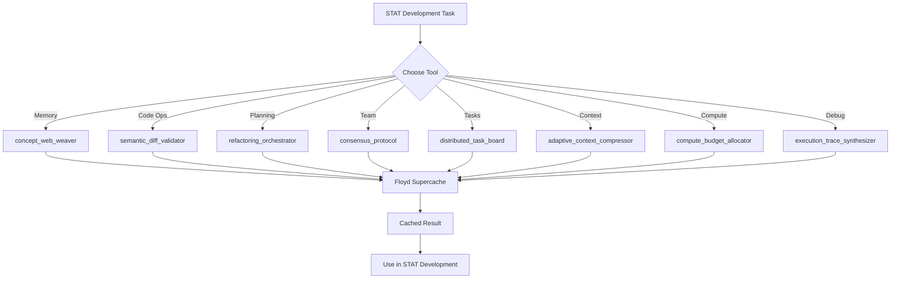

# Novel Concepts MCP Tools - Technical Specification

**Based on:** /Volumes/Storage/MCP/novel-concepts-server/dist/src/tools/

**Last Updated:** 2026-02-01

---

## Tool Definitions

### 1. concept-web-weaver

**Module:** `concept-web-weaver.js`
**Purpose:** Build concept graphs showing relationships between ideas

**Expected Interface:**
```typescript
{
  centralConcept: string;
  concepts: Array<{
    name: string;
    type: string;
    attributes: string[];
    relationships: Array<{
      to: string;
      type: string;
      strength: number;
    }>;
  }>;
  metadata?: Record<string, any>;
}
```

**STAT Test Case:**
- Input: STAT 4-role canon architecture
- Central concept: "STAT Roles Architecture"
- Concepts: Companion, Observer, Advisor, Leadership
- Relationships: "provides_data_to", "escalates_to", "advises", "oversees"

---

### 2. episodic-memory-bank

**Module:** `episodic-memory-bank.js`
**Purpose:** Store and retrieve problem-solving episodes

**Expected Interface:**
```typescript
{
  episodeType: string;
  title: string;
  problem: string;
  solution: string;
  outcome: string;
  keyDecisions: string[];
  participants: string[];
  timestamp: string;
  tags: string[];
  duration?: string;
}
```

**STAT Test Case:**
- Episode type: "system_design_decision"
- Title: "Phase 3: Attestation System Implementation"
- Problem: "STAT used cosmetic status instead of legal attestation"
- Solution: "Implemented attestation system with 7 deliverables"
- Outcome: "2,134 lines, 58/58 tests passing, HIPAA compliant"

---

### 3. analogy-synthesizer

**Module:** `analogy-synthesizer.js`
**Purpose:** Generate real-world analogies for complex systems

**Expected Interface:**
```typescript
{
  system: string;
  targetAudience: string;
  complexity: "simple" | "medium" | "detailed";
  analogyType?: "financial" | "legal" | "mechanical" | "biological";
  keyFeatures: string[];
}
```

**STAT Test Case:**
- System: "STAT Clawback Protection with 10 shadow tables"
- Target audience: "Healthcare administrators"
- Complexity: "medium"
- Key features: "append-only shadows", "defense builder", "audit timeline"

---

### 4. semantic-diff-validator

**Module:** `semantic-diff-validator.js`
**Purpose:** Validate code changes for correctness and consistency

**Expected Interface:**
```typescript
{
  originalCode: string;
  modifiedCode: string;
  language: string;
  validationChecks: string[];
  context?: Record<string, any>;
}
```

**STAT Test Case:**
- Original: `Action` enum without `ViewAuditTrail`
- Modified: `Action` enum with `ViewAuditTrail` added
- Language: "rust"
- Validation checks: ["naming_convention", "rbac_consistency", "breaking_changes"]

---

### 5. refactoring-orchestrator

**Module:** `refactoring-orchestrator.js`
**Purpose:** Plan complex multi-file refactoring operations

**Expected Interface:**
```typescript
{
  objective: string;
  scope: string[];
  constraints: string[];
  dependencies: string[];
  priority: "low" | "medium" | "high" | "critical";
}
```

**STAT Test Case:**
- Objective: "Remove 10 executive personas, implement 4 STAT roles"
- Scope: Frontend components, backend services, database schema
- Constraints: "maintain HIPAA compliance", "zero downtime"
- Dependencies: ["Phase 0: Authorization", "Phase 1: Ledger"]

---

### 6. consensus-protocol

**Module:** `consensus-protocol.js`
**Purpose:** Run multi-agent deliberation on technical decisions

**Expected Interface:**
```typescript
{
  question: string;
  context: string;
  agents: Array<{
    name: string;
    perspective: string;
    arguments: string[];
  }>;
  criteria: string[];
}
```

**STAT Test Case:**
- Question: "Should STAT use SQLx or Diesel?"
- Agents: Security, Performance, Developer Experience
- Criteria: ["compile-time_safety", "performance", "developer_experience", "team_familiarity"]

---

### 7. distributed-task-board

**Module:** `distributed-task-board.js`
**Purpose:** Create and manage task boards with dependencies

**Expected Interface:**
```typescript
{
  projectName: string;
  tasks: Array<{
    id: string;
    title: string;
    status: "pending" | "in_progress" | "completed" | "blocked";
    assignee?: string;
    blockedBy?: string[];
    blocks?: string[];
    priority: number;
  }>;
}
```

**STAT Test Case:**
- Project: "STAT Finalization Refactor"
- Tasks: Phases 0-8 with subtasks
- Dependencies: Phase 0 → Phase 1 → Phase 2 → ...

---

### 8. adaptive-context-compressor

**Module:** `adaptive-context-compressor.js`
**Purpose:** Compress conversation context while preserving key information

**Expected Interface:**
```typescript
{
  context: string;
  targetLength: number;  // percentage of original
  preserve: string[];
  discard: string[];
  format: "markdown" | "json" | "plain";
}
```

**STAT Test Case:**
- Context: This conversation (500+ lines)
- Target length: 20% (100 lines)
- Preserve: ["technical_details", "code_references", "tool_names"]
- Discard: ["redundant_explanations", "conversational_filler"]

---

### 9. compute-budget-allocator

**Module:** `compute-budget-allocator.js`
**Purpose:** Allocate time/compute budget across subtasks

**Expected Interface:**
```typescript
{
  task: string;
  totalTime: number;  // seconds
  subtasks: Array<{
    name: string;
    estimatedTime: number;
    priority: number;
  }>;
  strategy: "sequential" | "parallel" | "adaptive";
}
```

**STAT Test Case:**
- Task: "Full STAT system verification"
- Total time: 600 seconds (10 minutes)
- Subtasks: Backend verification, frontend verification, database verification
- Strategy: "parallel" (backend + frontend simultaneously)

---

### 10. execution-trace-synthesizer

**Module:** `execution-trace-synthesizer.js`
**Purpose:** Generate execution traces for code analysis

**Expected Interface:**
```typescript
{
  code: string;
  language: string;
  entryPoint: string;
  inputs: Record<string, any>;
  traceDepth: "shallow" | "medium" | "deep";
}
```

**STAT Test Case:**
- Code: `authorize()` function from `backend/src/authorization/policy.rs`
- Language: "rust"
- Entry point: "authorize"
- Inputs: `{ action: "ViewRawRecord", role: "Observer", subject: {...} }`
- Trace depth: "medium"

---

## Cache Integration

All tool results should be cached using Floyd Supercache:

```typescript
// Store result
await mcp__floyd_supercache__cache_store({
  key: `novel:concept_weaver:stat_roles:${hash}`,
  value: conceptGraph,
  ttl: 86400  // 24 hours
});

// Retrieve result
const cached = await mcp__floyd_supercache__cache_retrieve({
  key: `novel:concept_weaver:stat_roles:${hash}`
});
```

**Cache Key Pattern:**
```
novel:{tool_name}:{use_case}:{content_hash}
```

---

## STAT Tool Usage Workflow



---

**Generated:** 2026-02-01
**Server Path:** /Volumes/Storage/MCP/novel-concepts-server/dist/src/
**Configuration:** ~/Library/Application Support/Claude/claude_desktop_config.json
