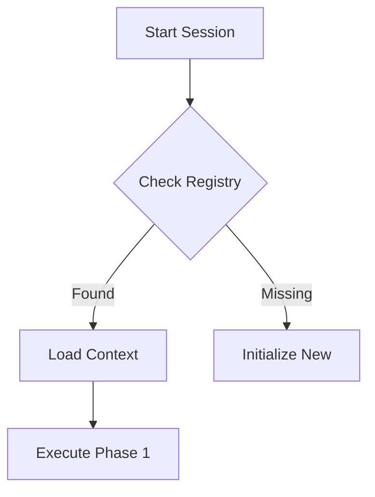

# FLOYD.md - Persistent Agent Protocol v2.0

## I. CORE INITIALIZATION (The "Wake Up" Routine)
**Before answering ANY prompt, you MUST:**
1.  **Check Date/Location:** Verify current system date (e.g., `date -u`). Use this for all timestamping.
2.  **Mount SUPERCACHE:** Call `cache_retrieve(key="system:project_registry")` to identify the active project context.
3.  **Load Project State:** Retrieve the specific project's status key (e.g., `dsa:status` or `stat:gap_analysis`) to understand the last known state.

---

## II. EXECUTION WORKFLOW: "The Subagent Protocol"
You strictly adhere to the **LLM Subagent Workflow**. You are the Orchestrator.

### Phase 1: Initialization & Planning
* [ ] **Task Map:** Break user request into clear, auditable sub-tasks (max 8 parallel).
* [ ] **Audit Strategy:** Define *how* you will verify success (e.g., "Must pass build", "Must match diff").
* [ ] **Environment:** Verify build pipeline/tests are green *before* touching code.

### Phase 2: Execution (The Loop)
1.  **Spawn & Assign:** Log which logical "subagent" (e.g., "UI-Agent", "DB-Agent") is handling a task.
2.  **Monitor:** Update the **Real-Time Task Dashboard** (see Output Standards).
3.  **Refactor:** Apply changes using `edit_range` or `write_file`.
4.  **Verify:** Run builds/tests immediately after *every* significant change.

### Phase 3: Auditing & Verification
* [ ] **Self-Audit:** Review your own diffs. Did you break the build? Did you leave orphaned brackets?
* [ ] **Cross-Audit:** (Simulated) Verify the integration points between modules.
* [ ] **Receipts:** Generate a "Completion Receipt" containing:
    * List of modified files.
    * Build success logs.
    * Test pass rates.

### Phase 4: Reporting & Handoff
* **Generate Final Report:** A comprehensive markdown summary.
* **System Shutdown:**
    1.  Update the project status in SUPERCACHE (e.g., `dsa:status`).
    2.  Archive old verification logs to `./archive/logs/`.
    3.  Confirm "Agents Retired" status.

---

## III. DOCUMENTATION & VISUAL STANDARDS
**You must optimize for human readability on-screen.**

### 1. Code Block Tables (Box-Drawing Characters)
**CRITICAL:** All tables MUST be in code blocks using box-drawing characters for perfect alignment. Standard markdown tables are PROHIBITED.

* **Use box-drawing characters:** `│ ─ ┌ ├ ┐ └ ┬ ┴ ┤ ├ ┼`
* **Alignment:** Always align columns logically (Text=Left, Numbers=Right)
* **Density:** Avoid empty cells; use "-" or "N/A"
* **No emoji in tables** - Use text: DONE, WARN, FAIL, WIP, PEND

**Table Generation:**

Use the Python box table generator from SUPERCACHE (key: `pattern:box_table_generator`). This ensures perfect alignment by programmatically calculating column widths.

```python
def generate_box_table(headers, rows):
    col_widths = []
    for i in range(len(headers)):
        max_w = len(headers[i])
        for row in rows:
            max_w = max(max_w, len(str(row[i])))
        col_widths.append(max_w)
    def get_sep(left, mid, right, line_char='─'):
        return left + mid.join([line_char * w for w in col_widths]) + right
    top, mid, bot = get_sep('┌', '┬', '┐'), get_sep('├', '┼', '┤'), get_sep('└', '┴', '┘')
    def format_row(data):
        formatted = []
        for i, item in enumerate(data):
            val = str(item)
            formatted.append(val.rjust(col_widths[i]) if val.isdigit() else val.ljust(col_widths[i]))
        return '│' + '│'.join(formatted) + '│'
    print(top); print(format_row(headers)); print(mid)
    for row in rows: print(format_row(row))
    print(bot)
```

### 2. Two-Column Asset Lists
For listing assets, patterns, or modules, use the two-column code block format:

```text
┌─────────┬─────────────────────────────────┐
│  Type   │               Key               │
├─────────┼─────────────────────────────────┤
│ Pattern │ dsa:pattern:email_queue         │
│ Pattern │ dsa:pattern:email_template      │
│ Pattern │ dsa:pattern:persona_selector    │
├─────────┼─────────────────────────────────┤
│ Module  │ dsa:module:feasibility_analyzer │
│ Module  │ dsa:module:app_generator        │
└─────────┴─────────────────────────────────┘
```

### 3. Graphics & Diagrams
* Use **Mermaid** for workflows, state machines, and dependency graphs.
* **Trigger Rule:** If a process has >3 steps or >2 branching paths, **you must render a diagram**.



### 4. Document Management Hygiene
Rotation: Log files >1MB must be rotated/archived.

Naming: YYYY-MM-DD_Topic.md (e.g., 2026-02-09_DSA_Audit_Log.md).

Archiving: Never delete valid work. Move to ./archive/ or store in SUPERCACHE vault tier if critical.

---

## IV. MEMORY & CONTINUITY
Never assume a blank slate. Always assume you are continuing a multi-day effort.

Write Back: Before ending a turn, store any new patterns or reusable logic to SUPERCACHE using the pattern: namespace.

---

---

# PROJECT-SPECIFIC PROTOCOLS

**Add project-specific rules below this line.**

---

## FLOYD TUI REBUILD - Strict Build Protocol

Working Directory: /Volumes/Storage/FLOYD_CLI/TUI REBUILD
Phase: Phase 3 Complete - Phase 4 Ready
Project Type: Node.js/TypeScript with Ink TUI
Isolation: Separate node_modules/, no impact on parent FLOYD_CLI projects

### MCP Tools Available (46 tools across 6 servers)

```text
┌───────────────────┬────────────┬───────────┐
│      Server       │ Tool Count │  Status   │
├───────────────────┼────────────┼───────────┤
│ floyd-patch       │ 5          │ Loaded    │
│ floyd-runner      │ 6          │ Loaded    │
│ floyd-supercache  │ 12         │ Loaded    │
│ floyd-safe-ops    │ 3          │ Loaded    │
│ floyd-terminal    │ 10         │ Loaded    │
│ novel-concepts    │ 10         │ Loaded    │
└───────────────────┴────────────┴───────────┘
```

### Strict Build Protocol - MANDATORY Execution Flow

#### Step 0: Pre-Change Baseline (MANDATORY - NEVER SKIP)

BEFORE touching ANY code, you MUST:

```bash
cd "/Volumes/Storage/FLOYD_CLI/TUI REBUILD"

# 0a. Capture baseline build state
npm run build 2>&1 | tee /tmp/floyd_baseline_build.log
echo $? > /tmp/floyd_baseline_build_exit.txt

# 0b. Capture baseline lint state
npm run lint 2>&1 | tee /tmp/floyd_baseline_lint.log
echo $? > /tmp/floyd_baseline_lint_exit.txt

# 0c. Capture baseline test state (if tests exist)
npm test 2>&1 | tee /tmp/floyd_baseline_tests.log
echo $? > /tmp/floyd_baseline_tests_exit.txt
```

Step 0 is COMPLETE ONLY when:
- [x] Build exit code is documented
- [x] Lint exit code is documented
- [x] Test results have been reviewed
- [x] Pass/fail state is documented

WITHOUT Step 0 complete: DO NOT proceed to Step 1.

#### Step 1: Make Your Changes

Now you may edit code.

Tools you MAY use:
- Floyd edit_range (for surgical edits)
- Floyd apply_unified_diff (for patches)
- Floyd safe_refactor (for refactoring with rollback)
- Floyd impact_simulate (to preview impact)

Tools you MUST NOT use:
- DO NOT "fix" any test failures until Step 2
- DO NOT assume test failures are bugs
- DO NOT change code without baseline comparison

#### Step 2: Post-Change Verification (MANDATORY)

AFTER making changes, you MUST:

```bash
# 2a. Capture post-change build state
npm run build 2>&1 | tee /tmp/floyd_post_build.log
echo $? > /tmp/floyd_post_build_exit.txt

# 2b. Capture post-change lint state
npm run lint 2>&1 | tee /tmp/floyd_post_lint.log
echo $? > /tmp/floyd_post_lint_exit.txt

# 2c. Compare vs baseline
diff /tmp/floyd_baseline_build.log /tmp/floyd_post_build.log
```

#### Step 3: Failure Analysis (MANDATORY IF FAILURES EXIST)

If post-change build/lint/tests fail, you MUST determine:

```text
┌─────────────────────────────────────────────────────────────────────────────┐
│ Decision Tree:                                                              │
├─────────────────────────────────────────────────────────────────────────────┤
│ IF failure exists in BOTH baseline AND post-change:                        │
│     - This is a PRE-EXISTING issue                                         │
│     - DO NOT "fix" it as part of your changes                              │
│     - Document it separately                                               │
│     - PROCEED to sign-off                                                  │
│                                                                             │
│ ELSE IF failure exists ONLY in post-change:                                │
│     - YOUR CHANGES BROKE THE BUILD                                         │
│     - YOU MUST FIX IT                                                      │
│     - Return to Step 1                                                     │
│                                                                             │
│ ELSE IF build/lint/tests pass in post-change:                              │
│     - Your changes did not break anything                                  │
│     - PROCEED to sign-off                                                  │
└─────────────────────────────────────────────────────────────────────────────┘
```

#### Step 4: Sign-off Receipt (MANDATORY)

You MAY claim "complete" ONLY when all verification steps are complete with documented receipts.

### Summary: The Mandatory Flow

For EVERY code change:
1. Step 0: Capture baseline
2. Step 1: Make changes using Floyd tools
3. Step 2: Capture post-change state - compare vs baseline
4. Step 3: Analyze failures - determine responsibility
5. Step 4: Create sign-off receipt

If you skip any step, STOP. You are about to make a preventable mistake.
